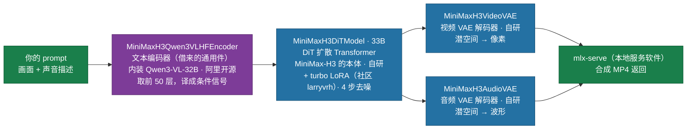

# MiniMax-H3 macOS 本地部署指南

本指南带你在 Apple Silicon Mac 上从零部署 **MiniMax-H3**——一个能同时生成**画面和声音**的开源视频模型——并成功生成第一条视频。全程只需按顺序执行，每一步都说明"在做什么、为什么"。

读完后你会得到：一个本地 HTTP 服务，给它一段文字描述，十几分钟后拿回一条带音效/配乐感的 MP4。

> 正文 §5–§9 是提纯后的成功路径；部署中那次隐蔽权重损坏的完整排查与修复实录，收录在本文 §11。

## 1. 先确认你具备什么

| 项 | 要求 | 说明 |
|---|---|---|
| 硬件 | Apple Silicon，**统一内存 ≥ 48GB** | 本指南实测 M4 Pro 48GB |
| 磁盘 | **≥ 200GB 空闲** | 官方权重 134GB + 重建产物 40GB |
| 系统 | macOS 15+（实测 26.5） | |
| 网络 | 能访问 ModelScope 与 HuggingFace | 下载 134GB，约 11 小时（限速见 §5.1） |
| 时间 | 下载近 1 天；重建 5 分钟；生成一条 5 秒视频约 12 分钟 | |

> **许可提醒**：MiniMax-H3 权重采用 MiniMax Community License，对部分国家/地区（含 EU/UK/KR/US）的使用有限制，商用前请自行确认合规。

## 2. 原理与术语

### MiniMax-H3 生成视频流程

MiniMax-H3是一个**扩散模型（diffusion model）**：从一团纯噪声开始，反复"去噪"几步，噪声就逐渐显现成连贯的画面和声音。H3 的特别之处在于**视频和音频在同一个模型里一起去噪**，所以声音天然贴合画面（敲铁就有叮当声）。



> 官方 `model_index.json` 里整条流水线注册为 `MiniMaxH3Pipeline`，四个组件类名都带 **`MiniMaxH3` 前缀**——`MiniMaxH3DiTModel`（33B 本体）、`MiniMaxH3VideoVAE`、`MiniMaxH3AudioVAE`、`MiniMaxH3Qwen3VLHFEncoder`。
>
> 唯一"混血"的是最后一个（紫色）：MiniMax 的壳，里面装的是阿里 Qwen3-VL-32B 的权重，只取前 50 层——它不聊天、不生成文字，只当翻译官，把 prompt 变成一串 5120 维向量喂给 DiT（`text_dim: 5120` 正好是 Qwen3-VL 的隐藏层宽度，两个零件按这个接口拼在一起）。
>
> 整机借零件是业界常规：FLUX 借谷歌 T5、Stable Diffusion 3 借 T5+CLIP，就像 iPhone 整机是苹果的、摄像头传感器是索尼的。
>
> mlx-serve 不是模型零件，是本地服务软件；turbo LoRA 来自社区 larryvrh。所以你下载的 `text_encoder/` 那 62GiB 分片就是 Qwen3-VL-32B 的 BF16 权重，4-bit 包里 15.8GB 的 `text_encoder.safetensors` 是它量化后的样子，连分词器都是 Qwen 家的。

### 术语速查

| 术语 | 小白解释 |
|---|---|
| **DiT / transformer** | 模型的"大脑"（33B 参数），负责一步步把噪声想成画面和声音。文件名里的 `transformer.safetensors` 就是它 |
| **文本编码器（text encoder）** | 模型的"耳朵"，把你的 prompt 翻译成大脑能懂的数学信号；H3 用的是 Qwen3-VL-32B，但只加载其语言层 0–49（§5.1 因此跳过部分分片）。本地部署看到的就是你写的原文，不会像某些云端 API 那样自动扩写 |
| **VAE（变分自编码器）** | "翻译官"：扩散发生在压缩过的**潜空间（latent）**里省算力，VAE 负责把潜空间结果还原成像素/波形。视频、音频各一个 |
| **去噪步数（steps）** | 从噪声到成品的迭代次数。越多越精细但越慢；配合 turbo LoRA 只需 **4 步** |
| **turbo LoRA** | 一小片"外挂"权重（约 780MB，即 779,849,816 字节），套在大脑上让它用极少步数出好结果——这就是 4 步够用的原因 |
| **量化（quantization）/ 4-bit** | 把每个权重从 16 位浮点压成 4 位整数，体积/内存省 4 倍，画质损失极小。`group_size 64` 表示每 64 个权重共享一组缩放参数 |
| **safetensors / 分片** | 存权重的文件格式；太大就切成多个"分片"（shard）文件 |
| **MLX / 统一内存** | Apple 的机器学习框架；Mac 的 CPU/GPU 共享同一块内存，48GB 内存因此装得下 40GB 的 4-bit 模型 |
| **mlx-serve** | 本地推理服务器，加载模型包并通过 HTTP 接口（默认 `:11234`）提供生成服务 |
| **seed（随机种子）** | 初始噪声的"编号"。同样参数+同样 seed = 完全相同的视频，方便复现 |
| **chain_windows** | 长视频切成若干"窗口"逐段生成再拼接；窗口越多时长越长，但接缝处会有累积误差 |

## 3. 准备环境

开工前先自检机器：`uname -m` 应输出 `arm64`（Intel Mac 的 `x86_64` 路线不在本指南支持范围）；编译工具、Homebrew、uv 都在下面一次装齐，Python 3.12 就由 uv 提供。

这些依赖各管流水线的一段，没有一个多余（跑模型本体的 mlx-serve 单独装，见第 3 步）：

| 依赖（来源） | 在本指南里干什么 | 谁在调用它 |
|---|---|---|
| **aria2**（brew） | 多连接下载器：单文件 8 连接、3 文件并行抢满限速带宽，支持断点续传，负责下 134GB 官方权重 | §5.1 的下载脚本（shell 调 `aria2c`） |
| **ffmpeg**（brew） | 封装器：模型吐出的是"原始画面帧 + PCM 裸音频"，由它编码成能播放的 MP4/M4A | §9 的 `generate.py` 收尾时 |
| **mlx**（pip） | Apple 的 ML 框架：`convert.py` 用它的 CPU 流做确定性 4-bit 量化，产物本身就是 MLX 格式 | §6 的 `convert.py` |
| **numpy**（pip） | 数值扫描/校正：64KB 粒度零洞体检、chain 模式接缝漂移校正、验证时的数值容差比对 | §5.2 `scan.py`、§7 `verify.py`、§9 `generate.py --fix-drift` |
| **requests**（pip） | HTTP 客户端：向 ModelScope API 要文件清单和字节级大小（用于校验） | §5.1 的下载脚本 |
| **hf**（pip，huggingface_hub CLI） | HuggingFace 下载客户端：拉 780MB 的 turbo LoRA | §5.3 的 `hf download` |

然后：

```bash
# 1) Xcode Command Line Tools（编译原生代码要用；已装会提示 command line tools are already installed）
xcode-select --install

# 2) Homebrew（已装可跳过；装完按提示把 brew 加入 PATH）
/bin/bash -c "$(curl -fsSL https://raw.githubusercontent.com/Homebrew/install/HEAD/install.sh)"

# 3) 系统依赖（brew）：aria2 下权重、ffmpeg 封装 MP4、mlx-serve 跑模型本体
brew install aria2 ffmpeg
brew tap ddalcu/mlx-serve && brew trust ddalcu/mlx-serve && brew install mlx-serve

# 4) uv（Python 版本管理器；装完 source 让当前终端立即可用）
curl -LsSf https://astral.sh/uv/install.sh | sh
source "$HOME/.local/bin/env"

# 5) Python 3.12 虚拟环境（重建用 mlx+numpy；§5.1 下载权重用 requests、§5.3 取 LoRA 用 hf CLI）
mkdir -p ~/llm-lab/src
uv venv --python 3.12 --seed ~/llm-lab/.venv-h3
~/llm-lab/.venv-h3/bin/pip install mlx numpy requests "huggingface_hub[cli]"

# 6) 拿到重建工具箱（HF 仓库，不是 GitHub）
cd ~/llm-lab/src
git clone https://huggingface.co/uetuluk2/minimax-h3-mlx-rebuild
cd minimax-h3-mlx-rebuild
```

> 建议在"系统设置 → 电池"中开启**高能耗模式（High Power Mode）**，生成速度可差 2 倍以上。

## 4. 量化流水线

**§5–§8 四步（备料 → 重建 → 验证 → 起服务）串起来只干一件事：**把 144GB 的官方 BF16 权重变成约 40GB 的 4-bit 模型包**，塞进 48GB 统一内存里跑。真正的"量化"只发生在第二步那 5 分钟；其余三步是围绕它的**物流**（下原料）、**质检**（证明转换无误）和**上架**（起服务）。

### 为什么必须量化

官方只发布 **BF16** 全精度权重——每个参数 16 位、占 2 字节，全家桶 144GB。而 Mac 的统一内存是 CPU/GPU 共用的一整块，48GB 机器刨去系统占用连一半都装不下。**4-bit 量化**把每个参数压到 4 位（0.5 字节），体积与内存占用约 ÷4，变成约 40GB，48GB 就够了；画质损失在视频生成里几乎不可感知。

### 量化原理：config.json 那三个字段的含义

`"quantization": {"group_size": 64, "bits": 4, "mode": "affine"}` 描述的是 MLX 的**分组仿射量化**，不是粗暴砍位数：

1. **分组**：把权重按每 **64** 个一组切开（`group_size: 64`）；
2. **标定**：每组统计自己的数值范围，算出一对浮点数 `scale`（步长）与 `bias`（零点偏移）；
3. **落档**：组内每个权重映射到 **4-bit 的 16 个档位（0–15）**中最接近的一个，只存档位号（`bits: 4`；`mode: "affine"` 即线性映射 `w ≈ scale × q + bias`）；
4. **还原**：推理时按公式反算回浮点，误差被锁在"每组 64 个、相邻档位之间"的小范围里。

为什么分组而不是全模型共用一把尺？权重常有离群值——个别特别大的数会把整条数轴撑开，其余权重全被挤进一两个档位、精度崩掉；每 64 个一组各配各的尺，离群值只影响自己那组。代价是每组多存一对 scale/bias，`4-bit + 组 64` 是 MLX 社区通用的平衡点。

### 重建还做了量化之外的两件事

§6 的 `convert.py` 能和官方发布包**逐字节一致**，除了量化本身，还因为它照着发布包逐张量对齐：

- **量化/保原二分**：发布包 safetensors 头里带 `.scales`/`.biases` 伴随张量的走 4-bit 量化，其余张量保持稠密原样——哪些量化、哪些保原，完全由发布包自己的清单决定，不是猜的；
- **qkv 行重排**：官方 DiT 的 52 个 `qkv_proj` 矩阵按每个注意力头的 `[q,k,v]` 交错存放，运行时要的是全局 `[全部q;全部k;全部v]`——不重排则注意力层整体乱码，重排后再量化才能逐字节对上。

以及为什么强调 **CPU 流**：`convert.py` 用 `with mx.stream(mx.cpu)` 执行量化，同样输入永远得到同样的输出比特（GPU 并行路径不保证）。这份确定性撑起两件事——任何人任何机器跑出的包都相同；§7 因此敢和 HuggingFace 官方发布包做**字节级**比对，字节相同即严格等价，不是"看起来差不多"。

### 四步流水线总览

```mermaid
flowchart LR
    subgraph STEP1["§5 第一步 · 备齐原料（约 11 小时）"]
        MS["ModelScope 官方仓库<br>BF16 全量 144GB<br>跳过 TE 00012/00013<br>实际下载 134GB"]:::src --> DL["aria2 下载脚本<br>8 连接 × 3 文件并行"]:::net --> FS["finescan 体检<br>64KB 粒度扫全零空洞"]:::qa
        HF["HuggingFace 社区"]:::src --> LORA["turbo LoRA 780MB<br>+ 手写 config.json 724B"]:::net
    end
    subgraph STEP2["§6 第二步 · 量化重建 convert.py（约 5 分钟）"]
        FS --> Q["mx.quantize · CPU 流<br>4-bit affine · group 64<br>+ qkv 行重排"]:::core --> OUT["模型包 · 4 个大文件约 40GB<br>transformer 18.7 / text_encoder 15.8<br>video_vae 5.2 / audio_vae 0.6 GB"]:::core
        LORA -. 提前补进包目录 .-> OUT
    end
    subgraph STEP3["§7 第三步 · 验证 verify.py（几分钟）"]
        OUT --> V1["结构校验<br>名称 / 形状 / dtype"]:::qa --> V2["抽样逐字节比对<br>对比 HF 官方发布包"]:::qa
    end
    subgraph STEP4["§8 第四步 · 启动服务"]
        V2 --> SRV["mlx-serve 启动<br>只在启动时扫描模型目录"]:::net --> OK["GET /v1/models 出现 H3<br>capabilities: video<br>→ 去 §9 生成第一条视频"]:::ready
    end
    classDef src fill:#7d3c98,color:#fff,stroke:#5b2c6f
    classDef net fill:#1a7f4b,color:#fff,stroke:#0d5c34
    classDef core fill:#2471a3,color:#fff,stroke:#1a5276
    classDef qa fill:#b9770e,color:#fff,stroke:#8e6108
    classDef ready fill:#148f77,color:#fff,stroke:#0b5c4b
```



> 颜色含义：紫 = 远端原料；绿 = 传输与搬运；蓝 = 本地计算（量化核心）；橙 = 质检；青 = 就绪。

## 5. 第一步：备齐原料（约 134GB，下载数小时，全程最耗时）

"重建"（§6）好比做菜：主料是官方 BF16 权重，`convert.py` 会把它转成模型包里的 4 个大文件；但模型包还差两个文件是官方权重推导不出来的，得像小料一样另配。本步结束时，下面三样原料全部到位：

| 原料 | 大小 | 来源 | 去向 |
|---|---|---|---|
| 官方 BF16 权重（主料） | 约 134GB | ModelScope `MiniMax/MiniMax-H3` | 下到 `official/FL2VA/`，§6 转出 4 个大文件 |
| `turbo_lora.safetensors`（小料） | 780MB | HuggingFace 社区 larryvrh（Apache-2.0） | 5.3 放进模型包目录 |
| `config.json`（小料） | 724B | 手写，内容见 5.3 | 5.3 放进模型包目录 |

三个小节依次做：**5.1 下主料**（最耗时）→ **5.2 体检**（防"暗伤"）→ **5.3 补小料**（几分钟）。

### 5.1 下载官方权重

模型官方只发布 BF16 全精度权重，托管在 ModelScope 的 `MiniMax/MiniMax-H3` 仓库 `FL2VA/` 目录。需要下载的部分：

```text
FL2VA/transformer/    model-0000*.safetensors 全部 13 片 + index.json   # DiT 大脑
FL2VA/text_encoder/   分片 00001~00011、00014 + index.json             # 文本编码器（00012/00013 跳过，见下）
FL2VA/video_vae/      source/model.safetensors + config.json    # 视频 VAE
FL2VA/audio_vae/      model.safetensors                         # 音频 VAE
FL2VA/processor|tokenizer/  tokenizer.json 等 4 个小文件        # 分词器
```

> 文本编码器第 50–63 层 H3 用不到，其中第 53–63 层恰好整装在 **00012、00013 两个分片**里，可以不下，立省约 10GB（全量 144GB → 实际下载约 134GB）。

下载要点（血泪结晶，直接照做）：

- 用 **aria2** 不用 modelscope CLI：单文件 `-x8`（8 连接），**同时只下 3 个文件**。ModelScope 单 IP 聚合限速 ~3.5MB/s，worker 更多反而更慢。
- 直接运行随本指南附带的下载脚本（已内置上述调优和 00012/00013 跳过，实际下载 80 个文件、约 134GB）：

```bash
~/llm-lab/.venv-h3/bin/python scripts/download.py
```

- 脚本不带重试，中断后重新运行即可（aria2 `-c` 断点续传，已完成文件按大小跳过）；单连接停滞（速度长期卡在 ~200KB/s）同样靠中断重跑恢复全速。

<details>
<summary>scripts/download.py</summary>

```python
#!/usr/bin/env python3
# 从 ModelScope CDN 用 aria2 并行下载 MiniMax-H3 FL2VA 权重(已验证)
# 用法: ~/llm-lab/.venv-h3/bin/python download.py
#   (venv 需 pip install requests, 见部署指南 §3)
# 背景: modelscope CLI 只有 2-7 MB/s; CDN 单文件 8 连接实测最高 ~57 MB/s,
#       但持续吞吐被限到每文件 ~1.5-1.8 MB/s,所以用 3 文件并行池拉聚合带宽
#       (实测 3 并发最优; 6 并发反而被压到每文件 ~0.5MB/s)
# 依赖: requests, aria2(brew install aria2)
# 输出: ~/llm-lab/src/minimax-h3-mlx-rebuild/official/FL2VA/
#       (自动跳过 convert 不用的 text_encoder 00012/00013 分片
#        ——只装第 53-63 层, 立省 ~10GB: 80 个文件, ~134GB; 全量 144GB)
# 断点续传: 已完成文件跳过; 部分文件靠 aria2 --continue 从 .aria2 控制文件续传
import os
import subprocess
import sys
import time
from concurrent.futures import ThreadPoolExecutor

import requests

ROOT = os.path.expanduser("~/llm-lab/src/minimax-h3-mlx-rebuild/official")
API = ("https://modelscope.cn/api/v1/models/MiniMax/MiniMax-H3/"
       "repo/files?Revision=master&Recursive=true")
CDN = ("https://modelscope.cn/api/v1/models/MiniMax/MiniMax-H3/"
       "repo?Revision=master&FilePath=")
WORKERS = 3  # 实测: 4 并行时每文件 ~1.5MB/s; 6 并行反而被压到 ~0.5MB/s
T0 = time.time()
STATS = {"done": 0, "skip": 0, "bytes": 0}


def fetch_file(f):
    dst = os.path.join(ROOT, f["Path"])
    os.makedirs(os.path.dirname(dst), exist_ok=True)
    if os.path.exists(dst) and os.path.getsize(dst) == f["Size"]:
        STATS["skip"] += 1
        STATS["bytes"] += f["Size"]
        return f"skip   {f['Path']}"
    # modelscope CLI 的 .incomplete 无法被 aria2 续传,删除重下
    inc = dst + ".incomplete"
    if os.path.exists(inc):
        os.remove(inc)
    url = CDN + requests.utils.quote(f["Path"], safe="/")
    cmd = ["aria2c", "-x8", "-s8", "-k1M", "--file-allocation=none",
           "--continue=true", "--auto-file-renaming=false",
           "--console-log-level=warn", "--summary-interval=10",
           "-d", os.path.dirname(dst), "-o", os.path.basename(dst), url]
    subprocess.run(cmd, check=True)
    sz = os.path.getsize(dst)
    if sz != f["Size"]:
        print(f"FAILED size mismatch {f['Path']}: {sz} != {f['Size']}", flush=True)
        os._exit(1)
    STATS["done"] += 1
    STATS["bytes"] += sz
    el = time.time() - T0
    return (f"[{STATS['done']}/{len(TODO)}] {f['Path']}  {sz / 1e9:.2f}GB  "
            f"(pool {STATS['bytes'] / 1e9:.1f}/{TOTAL / 1e9:.1f}GB, "
            f"{STATS['bytes'] / 1e6 / el:.1f}MB/s avg)")


def main():
    global TODO, TOTAL
    files = requests.get(API, timeout=30).json()["Data"]["Files"]
    # H3 只加载文本编码器的语言层 0-49, 第 50-63 层用不到;
    # 其中 53-63 层整装在 TE 00012/00013 两个分片, 跳过立省 ~10GB
    SKIP = {"FL2VA/text_encoder/model-00012-of-00014.safetensors",
            "FL2VA/text_encoder/model-00013-of-00014.safetensors"}
    TODO = [f for f in files
            if f["Path"].startswith("FL2VA/") and f["Path"] not in SKIP]
    TODO.sort(key=lambda f: -f["Size"])
    TOTAL = sum(f["Size"] for f in TODO)
    print(f"{len(TODO)} files, {TOTAL / 1e9:.1f}GB, {WORKERS} parallel workers",
          flush=True)
    with ThreadPoolExecutor(max_workers=WORKERS) as ex:
        for msg in ex.map(fetch_file, TODO):
            print(msg, flush=True)
    print(f"ALL DONE: {STATS['done']} downloaded, {STATS['skip']} skipped, "
          f"{TOTAL / 1e9:.1f}GB total", flush=True)


if __name__ == "__main__":
    main()
```

</details>

### 5.2 体检：扫描"全零空洞"（几分钟，别跳过）

只核对文件大小不可靠——下载中断可能留下"大小正确、内容全零"的空洞；这种权重生成的画面会与 prompt 完全无关（§11 排错实录的元凶就是它）。所以下完必须做内容级体检，确认没有暗伤：

```bash
# 体检脚本随本指南附带：scripts/scan.py
# 脚本默认扫描 ~/llm-lab/src/minimax-h3-mlx-rebuild/official/FL2VA
~/llm-lab/.venv-h3/bin/python scripts/scan.py
# 输出 DONE: 0 real holes patched 即为健康；发现空洞会自动从远端补齐
```

<details>
<summary>scripts/scan.py</summary>

```python
#!/usr/bin/env python3
"""Fine-grained hole scan + patch for all convert-used FL2VA files.

Coarse scan (4MB min run) missed a 0.8MB hole in TE shard 00003. This pass
uses 64KB zero blocks. Candidate regions are fetched from ModelScope:
  - remote also zero  -> genuine data (e.g. TF-00013 adaln zeros), skip
  - remote differs    -> real hole: write remote bytes (with 1MB pad), recount
Non-zero garbage is not expected from the aria2 prealloc failure mode; the
post-patch pack byte-verify + functional generation test are the backstop.
"""
import json, os, subprocess, sys, time
import numpy as np

REPO = os.path.expanduser("~/llm-lab/src/minimax-h3-mlx-rebuild")
SRC  = f"{REPO}/official/FL2VA"
MS   = ("https://modelscope.cn/api/v1/models/MiniMax/MiniMax-H3/repo"
        "?Revision=master&FilePath=FL2VA/")
BLK, PAD = 2**16, 2**20
# fully byte-verified legit-zero region: (file, lo, hi) — skip fetching
LEGIT = [("transformer/model-00013-of-00013.safetensors", 2893520024, 3413744792)]

files = [f"text_encoder/model-{i:05d}-of-00014.safetensors" for i in
         list(range(1, 12)) + [14]] \
      + [f"transformer/model-{i:05d}-of-00013.safetensors" for i in range(1, 14)] \
      + ["video_vae/source/model.safetensors", "audio_vae/model.safetensors"]

def zero_runs(path):
    size = os.path.getsize(path)
    runs, cur = [], None
    with open(path, "rb") as f:
        off = 0
        while off < size:
            chunk = f.read(1024 * BLK)          # 64MB
            if not chunk:
                break
            a = np.frombuffer(chunk, dtype=np.uint8)
            nb = len(a) // BLK
            z = ~(a[: nb * BLK].reshape(nb, BLK)).any(axis=1)
            for i, zz in enumerate(z):
                b = off // BLK + i
                if zz and cur is None:
                    cur = b
                elif not zz and cur is not None:
                    runs.append((cur * BLK, b * BLK)); cur = None
            off += len(a)
    if cur is not None:
        runs.append((cur * BLK, (size // BLK + 1) * BLK))
    return [(s, min(e, size)) for s, e in runs]

def fetch(url, a, b, tries=4):
    for t in range(tries):
        r = subprocess.run(["curl", "-sL", "--max-time", "900",
                            "-r", f"{a}-{b}", url], capture_output=True)
        if r.returncode == 0 and len(r.stdout) == b - a + 1:
            return r.stdout
        print(f"    retry {t+1} rc={r.returncode} got={len(r.stdout)}", flush=True)
        time.sleep(4)
    sys.exit(f"FATAL fetch {url} {a}-{b}")

tot_holes = tot_legit = tot_patched = 0
for rel in files:
    path = f"{SRC}/{rel}"
    if not os.path.exists(path):
        print(f"MISSING {rel}", flush=True); continue
    runs = zero_runs(path)
    if not runs:
        print(f"ok     {rel}", flush=True); continue
    url = MS + rel
    size = os.path.getsize(path)
    print(f"SCAN   {rel}: {len(runs)} candidate zero runs", flush=True)
    with open(path, "r+b") as f:
        for s, e in runs:
            if any(rel == lf and s >= lo and e <= hi for lf, lo, hi in LEGIT):
                tot_legit += 1
                print(f"    legit zeros [{s},{e}) skipped (verified region)", flush=True)
                continue
            ps, pe = max(0, s - PAD), min(size, e + PAD)
            rem = fetch(url, ps, pe - 1)
            f.seek(ps); loc = f.read(pe - ps)
            if loc == rem:
                tot_legit += 1
                print(f"    legit zeros [{s},{e}) match remote", flush=True)
                continue
            f.seek(ps); f.write(rem); f.flush(); os.fsync(f.fileno())
            tot_holes += 1; tot_patched += pe - ps
            print(f"    PATCHED hole [{s},{e}) ({(e-s)/1e6:.2f} MB, wrote {(pe-ps)/1e6:.2f} MB)", flush=True)

print(f"DONE: {tot_holes} real holes patched ({tot_patched/1e6:.1f} MB written), "
      f"{tot_legit} legit zero regions", flush=True)
```

</details>

### 5.3 补两件"小料"进模型包目录

`convert.py` 只写它自己转出的 4 个大文件，下面这两个它不会生成（跑完也会提醒你补），现在提前放进模型包目录：

```bash
# 1) turbo LoRA（Apache-2.0，来自社区 larryvrh，779,849,816 字节）
mkdir -p ~/.mlx-serve/models/ddalcu/MiniMax-H3-FL2VA-MLX-Serve-4bit
~/llm-lab/.venv-h3/bin/hf download larryvrh/MiniMax-H3-Turbo-Lora \
  minimax_h3_turbo_4step_ema_ckpt850.safetensors \
  --local-dir ~/.mlx-serve/models/ddalcu/MiniMax-H3-FL2VA-MLX-Serve-4bit
cd ~/.mlx-serve/models/ddalcu/MiniMax-H3-FL2VA-MLX-Serve-4bit
mv minimax_h3_turbo_4step_ema_ckpt850.safetensors turbo_lora.safetensors

# 2) config.json（724B），内容原样写入：
cat > config.json <<'EOF'
{
  "model_type": "minimax_h3",
  "partition": "fl2va",
  "tasks": [
    "t2va",
    "fl2va"
  ],
  "sigma_shift_scales": {
    "video": 12.0,
    "audio": 3.0
  },
  "fps": 24,
  "quantization": {
    "group_size": 64,
    "bits": 4,
    "mode": "affine"
  },
  "transformer": {
    "hidden_size": 5376,
    "num_layers": 50,
    "num_attention_heads": 56,
    "attention_head_dim": 128,
    "ffn_hidden_size": 14336,
    "latents_dim": 24,
    "audio_latents_dim": 32,
    "text_dim": 5120,
    "time_embed_dim": 2688,
    "rope_inv_freq_len": 16
  },
  "text_encoder": {
    "hidden": 5120,
    "layers": 50,
    "heads": 64,
    "kv_heads": 8,
    "head_dim": 128,
    "intermediate": 25600,
    "theta": 5000000.0
  }
}
EOF
cd ~/llm-lab/src/minimax-h3-mlx-rebuild
```

## 6. 第二步：重建 4-bit 包（约 5 分钟）

```bash
cd ~/llm-lab/src/minimax-h3-mlx-rebuild
~/llm-lab/.venv-h3/bin/python convert.py
```

它在做什么：读取官方 BF16 权重 → 在 CPU 流上做确定性 4-bit 量化（`mx.quantize`, group_size 64）→ 组装成与发布版**逐字节一致**的模型包，写入 `~/.mlx-serve/models/ddalcu/MiniMax-H3-FL2VA-MLX-Serve-4bit/`：

| 产物 | 大小 | 对应部件 |
|---|---|---|
| `transformer.safetensors` | 18.70 GB | DiT 大脑 |
| `text_encoder.safetensors` | 15.80 GB | 文本编码器 |
| `video_vae.safetensors` | 5.21 GB | 视频 VAE |
| `audio_vae.safetensors` | 0.61 GB | 音频 VAE |

## 7. 第三步：验证（几分钟）

```bash
~/llm-lab/.venv-h3/bin/python verify.py --bytes 5 --min-mb 10
```

先做结构校验（张量名称/形状/dtype/元数据），再从 HuggingFace 发布包随机抽大 tensor 做**逐字节比对**（`--bytes` 是每个部件抽几个；结构校验抓不住权重值损坏，字节比对才是关键）。CPU 量化是确定性的，抽中的张量字节一致即为严格相等——每一条都是精确证明而非统计估计，想覆盖更多就换 `--seed` 复跑。看到 `ALL CHECKS PASSED` 即可放心。

## 8. 第四步：启动服务

```bash
nohup mlx-serve --serve --model-dir ~/.mlx-serve/models \
  > ~/llm-lab/scripts/mlx-serve.log 2>&1 &
sleep 10
curl -s http://127.0.0.1:11234/v1/models | python3 -m json.tool
```

看到 `ddalcu/MiniMax-H3-FL2VA-MLX-Serve-4bit` 且 `capabilities` 含 `video` 即就绪。

> **注意**：mlx-serve **只在启动时扫描模型目录**。以后只要替换过模型文件，就必须重启服务。

## 9. 第五步：生成第一条视频（约 12 分钟）

```bash
cd ~/llm-lab/src/minimax-h3-mlx-rebuild
mkdir -p ~/llm-lab/outputs
nohup ~/llm-lab/.venv-h3/bin/python -u generate.py \
  "A blacksmith hammers a glowing orange horseshoe on an anvil in a dim workshop. Sparks burst outward with each strike. Rhythmic metallic clangs ring out and echo off stone walls." \
  --seconds 5 --width 832 --height 480 --steps 4 --turbo --seed 314159 \
  -o ~/llm-lab/outputs/my-first.mp4 > ~/llm-lab/scripts/h3-gen.log 2>&1 &
```

（封装脚本 [scripts/generate.sh](scripts/generate.sh) 做同样的事，但参数固定为 5 秒 832×480、不带 `--seed`，日志写在 `h3-generate.log`。）约 12 分钟后得到一条 5.17 秒、画面与声音同步的 MP4。本指南实拍效果：

| t=1s | t=7s | t=14s |
|---|---|---|
|  |  |  |

（上图来自 `chain_windows 3` 的 15 秒版本，完整视频：）

<video src="assets/h3-blacksmith-15s.mp4" controls>当前渲染器不支持内嵌播放（GitHub 网页端会过滤 video 标签），<a href="assets/h3-blacksmith-15s.mp4">点此打开播放页</a>。</video>

<details>
<summary>scripts/generate.sh</summary>

```bash
#!/bin/bash
# MiniMax-H3 本地生成脚本(MLX 4-bit, 基于 uetuluk2 重建流程)
# 前置: download.py 完成 + convert.py + verify.py 通过
# 用法: bash generate.sh ["提示词"] [输出文件]
# 默认: 5 秒 832x480 预览, turbo 4 步(实测 M5 Pro/48G 约 247s; M4 Pro 预计 7-12 分钟)
set -eu

PROMPT="${1:-a blacksmith hammering a glowing horseshoe, sparks flying, forge firelight}"
OUT="${2:-$HOME/llm-lab/outputs/h3-test.mp4}"

mkdir -p "$HOME/llm-lab/outputs"

# 1. 启动 mlx-serve(如未运行)
if ! curl -s http://127.0.0.1:11234/v1/models >/dev/null 2>&1; then
  echo "starting mlx-serve ..."
  nohup mlx-serve --serve --model-dir "$HOME/.mlx-serve/models" \
    > "$HOME/llm-lab/scripts/mlx-serve.log" 2>&1 &
  sleep 10
fi

# 2. 生成(must use nohup: 前台长时间任务在后台终端会被静默杀掉)
cd "$HOME/llm-lab/src/minimax-h3-mlx-rebuild"
nohup ~/llm-lab/.venv-h3/bin/python generate.py "$PROMPT" \
  --seconds 5 --width 832 --height 480 --steps 4 --turbo \
  -o "$OUT" > "$HOME/llm-lab/scripts/h3-generate.log" 2>&1 &

echo "generation started -> $OUT (log: ~/llm-lab/scripts/h3-generate.log)"
echo "watch: tail -f ~/llm-lab/scripts/h3-generate.log"
```

</details>

## 10. 使用指南

### 参数速查（`generate.py`）

| 参数 | 默认 | 说明 |
|---|---|---|
| `prompt` | 必填 | **画面和声音一起写**：`...Sparks burst... Rhythmic metallic clangs echo off stone walls.` |
| `--seconds` | — | 目标时长，自动吸附到最近的可达档位 |
| `--num-frames` | — | 精确帧数，必须是 **17k+5**（5、22、39…124…），24fps |
| `--width / --height` | 832×480 | 分辨率；降到 512×288 显著提速 |
| `--steps` | 4 | 去噪步数；配 turbo 用 4 即可 |
| `--turbo / --no-turbo` | turbo | 是否挂 turbo LoRA |
| `--chain-windows N` | 1 | 生成 N 段拼接，时长×N、耗时×N，接缝有累积漂移 |
| `--fix-drift` | 关 | 缓解 chain 模式接缝漂移 |
| `--audio-only` | 关 | 只要声音：视频压到 32×32，**约 10 秒**出一条氛围音频；输出后缀自动改为 `.m4a` |
| `--seed` | 随机 | 固定 seed 可精确复现 |
| `-o` | out.mp4 | 输出路径 |

### 提示词怎么写：官方"三段式"

官方完整系统在云端还有个前置模块 **H3-Context-IR**，负责把你的一句大白话扩写成模型最爱吃的结构化提示词（未开源，本地没有它——所以 §2 术语表说"本地看到的就是你写的原文"）。看官方扩写样例，提示词几乎总是三段：

| 段 | 写什么 | 官方示例片段 |
|---|---|---|
| `integrated_multimodal_description:` | 分镜头画面：机位/景别/运镜/主体/时间点 | `[Shot 1] Cinematic medium wide shot, pushing in slowly. ... [Shot 2] At 00:04.5, cut to a close-up ...` |
| `overall_soundscape:` | 现场声（有源音响）：环境底噪 + 事件声 | `A low resonant hum ..., escalating high-pitched whine ..., massive bass-heavy boom ...` |
| `non_diegetic_music:` | 配乐（无源音乐）：风格/节奏/情绪 | `Cinematic space-opera orchestral score, slow tempo, swelling to a massive peak ...` |

对白的官方语法是特殊标记 `<d>`（口型同步，稳定支持中英日韩等 11 种语言）：`<d>[English] Follow the wind, live free.</d>`。本地没有 Context-IR 前置，这些结构直接写进 prompt 即可，效果以实测为准。

官方能力对照（本地 4-bit 路线的边界）：

| 能力 | 官方云端 | 本地（本指南） |
|---|---|---|
| 时长 | 单次生成 4–15 秒，24fps | 单窗口 5.17s；`--chain-windows 3` ≈ 15.4s；更久用分段拍摄 + ffmpeg 拼接（示例 9 的 30 秒做法） |
| 分辨率 | 短边 768 起，可 2K（H3-Regenerate-2K） | 832×480 实用（48GB 内存上限）；1248×704 实测每段 35–46 分钟（见示例 9 实拍） |
| 首尾帧图生视频（fl2va） | 支持 0/1/2 张图（无图=t2va） | 模型支持，`generate.py` 未封装、未验证 |
| 多参考 Ref2VA / 2K 重生 / Context-IR | 支持 | 未开源/未包含，不在本路线 |

> 本地路线的宽高必须是 **32 的倍数**（服务端硬校验），常见档：512×288、832×480、1248×704。

> 官方 README 同时印证了 §2 的考证：文本编码器官方名为 **H3-Encoder**，原话是 "uses the full pretrained weights of Qwen3-VL-32B and provides the hidden states from its 50th layer"；DiT 官方名为 **H3-Omni-Transformer**（33B，其中约 13B 在 AdaLN 分支）。

### 示例集（复制即用）

均在 `~/llm-lab/src/minimax-h3-mlx-rebuild` 目录、服务已启动的前提下；耗时按 M4 Pro 48GB 估（示例 9 为实测）。

**1）低清试错**（512×288，约 3–5 分钟）——先花小钱验证构图和声音：

```bash
~/llm-lab/.venv-h3/bin/python generate.py \
  "Rain hammers a tin roof over a mountain cabin at night; one warm window glows; thunder rolls closer." \
  --seconds 5 --width 512 --height 288 --steps 4 --turbo --seed 42 \
  -o ~/llm-lab/outputs/draft-rain.mp4
```

**2）三段式完整 prompt**（832×480，约 12 分钟）——按官方结构写，画面/现场声/配乐各一段：

```bash
~/llm-lab/.venv-h3/bin/python generate.py \
"integrated_multimodal_description: [Shot 1] Cinematic medium wide shot, static camera. A tiny paper boat drifts down a rain-swollen street gutter, weaving past wet autumn leaves. [Shot 2] At 00:03.5, cut to a close-up: the boat wobbles toward a storm drain, tilts, and slips over the edge.
overall_soundscape: Continuous heavy rain on pavement; hollow patter close around the boat; a sudden gulping swirl as it reaches the drain.
non_diegetic_music: Soft melancholy piano, slow tempo, fading out as the boat disappears." \
  --seconds 5 --width 832 --height 480 --steps 4 --turbo --seed 7 \
  -o ~/llm-lab/outputs/paper-boat.mp4
```

**3）对白 + 口型**（官方 `<d>` 标记，832×480，约 12 分钟）：

```bash
~/llm-lab/.venv-h3/bin/python generate.py \
  "A barista behind a busy morning café counter looks straight into the camera, smiles and says <d>[English] Fresh roast, just for you.</d> Steam curls up from the cup; the espresso machine hisses behind her." \
  --seconds 5 --width 832 --height 480 --steps 4 --turbo --seed 11 \
  -o ~/llm-lab/outputs/barista.mp4
```

**4）只要声音**（约 10 秒，输出自动变 `.m4a`）：

```bash
~/llm-lab/.venv-h3/bin/python generate.py \
  "Crickets at dusk, a campfire crackling, an occasional owl call, wind through pines." \
  --audio-only --seconds 5 --seed 5 \
  -o ~/llm-lab/outputs/camp-dusk.m4a
```

**5）竖屏 9:16**（480×832，约 12 分钟；像素量与横屏相当）：

```bash
~/llm-lab/.venv-h3/bin/python generate.py \
  "Vertical shot: a skateboarder glides down a rain-slick street at dusk, city neon reflections streaking past." \
  --seconds 5 --width 480 --height 832 --steps 4 --turbo --seed 3 \
  -o ~/llm-lab/outputs/skate-vertical.mp4
```

**6）15 秒长片**（chain 3 + 漂移校正，约 40 分钟）：

```bash
~/llm-lab/.venv-h3/bin/python -u generate.py \
  "A blacksmith hammers a glowing orange horseshoe on an anvil in a dim workshop. Sparks burst outward with each strike. Rhythmic metallic clangs ring out and echo off stone walls." \
  --seconds 5 --width 832 --height 480 --steps 4 --turbo \
  --chain-windows 3 --fix-drift --seed 314159 \
  -o ~/llm-lab/outputs/blacksmith-15s.mp4
```

**7）同题不同种子**（挑最好的一条；每条约 12 分钟）：

```bash
for s in 1 2 3; do
  ~/llm-lab/.venv-h3/bin/python generate.py \
    "Waves crash against a lighthouse at dawn; the foghorn moans; gulls wheel overhead." \
    --width 832 --height 480 --seed $s \
    -o ~/llm-lab/outputs/lighthouse-$s.mp4
done
```

**8）绕过 generate.py，直接调 HTTP 接口**（原样投递 JSON）：

```bash
curl -s http://127.0.0.1:11234/v1/video/generations \
  -H 'Content-Type: application/json' -d '{
  "model": "ddalcu/MiniMax-H3-FL2VA-MLX-Serve-4bit",
  "prompt": "A blacksmith hammers a glowing horseshoe; sparks fly; metallic clangs echo.",
  "width": 832, "height": 480, "num_frames": 124,
  "steps": 4, "turbo": true, "chain_windows": 1, "seed": 314159
}' -o ~/llm-lab/outputs/raw-response.json
```

两个坑：返回的是 **JSON（base64 的裸帧序列 + PCM 裸音频），不是视频文件**，要自己封装——`generate.py` 干的就是这件事；字段名必须是 `num_frames`，写 `frames` 或 `length` 会被**静默忽略**并按 56 帧生成。

**9）剧情微电影：更清晰、明亮的 30 秒版 —— 分镜 + 转场 + 独白口型 + 配乐**（6 段 × 5.175s 分拍再拼接，`-t 30` 裁齐正好 30.0 秒；1248×704 每段实测 35–46 分钟、六段连排约 4 小时，赶时间退回 832×480 每段约 12.5 分钟）：

第 1 段（定场 + 台词口型，完整三段式 prompt）：

```bash
~/llm-lab/.venv-h3/bin/python generate.py \
"integrated_multimodal_description: [Shot 1] Crisp sun-drenched 7 AM morning at a countryside convenience store, clean bright blue sky, vivid colors. A cheerful young clerk in a green apron flips the door sign to OPEN, golden sunlight and soft lens flare. At 00:01.0 he looks straight into the camera and says <d>[English] Morning! Come on in.</d> with a bright smile.
overall_soundscape: Cheerful birdsong, a crisp door-chime ding, distant rooster, light morning traffic, one excited puppy yip far away.
non_diegetic_music: Warm acoustic guitar theme, bright major key, light strumming starts right at the sign flip." \
  --seconds 5 --width 1248 --height 704 --steps 4 --turbo --seed 21 \
  -o ~/llm-lab/outputs/morning-store-seg1.mp4
```

第 2–6 段照抄模板只换内容，分镜脚本如下（每段都是独立生成的"第一窗口"，段内时间码、台词锚点、硬切位置全部可靠）：

| 段 | 剧情拍（画面描述套进三段式模板） | 镜头与转场 |
|---|---|---|
| 1 | 清晨 7 点乡村便利店，店员翻开 OPEN 牌打招呼（命令见上） | 定场镜头；阳光定调 |
| 2 | 草坪上打滚的金毛幼犬被烤肉香勾住，抬头望向店铺 | 硬切到室外低角度 |
| 3 | 幼犬双爪扒上玻璃、鼻尖压扁、狂摇尾巴；店员隔窗对望 | 匹配剪辑：玻璃两侧互望 |
| 4 | 店员拿一根肉干、推门蹲下，晨光涌进门 | 动作衔接镜头 |
| 5 | 幼犬谨慎进店、径直扑向肉干，尾巴扫翻一个纸篮 | 室内跟拍，明亮暖光 |
| 6 | 幼犬吃饱趴在门口光斑里打盹；店员挂上 DOG FRIENDLY 小牌 | 缓慢拉远收尾，配乐收束 |

六段拼成一条 30 秒（要正好 30 秒就加 `-t 30` 裁齐）：

```bash
cd ~/llm-lab/outputs
ffmpeg -i morning-store-seg1.mp4 -i morning-store-seg2.mp4 -i morning-store-seg3.mp4 \
       -i morning-store-seg4.mp4 -i morning-store-seg5.mp4 -i morning-store-seg6.mp4 \
  -filter_complex "[0:v][0:a][1:v][1:a][2:v][2:a][3:v][3:a][4:v][4:a][5:v][5:a]concat=n=6:v=1:a=1[v][a]" \
  -map "[v]" -map "[a]" -t 30 morning-store-30s.mp4
```

本指南实拍：六段 1248×704 全部生成并拼接成功——成片正好 30.000 秒、14.2MB，模型也忠实执行了分镜（开场挂 OPEN 牌、中段人犬对望、结尾幼犬睡在门口光斑里、店员挂上 DOG FRIENDLY 牌）：

| t=1s（段1 · 定场挂 OPEN 牌） | t=13s（段3 · 扒上台面对望） | t=28s（段6 · DOG FRIENDLY 收尾） |
|---|---|---|
|  |  |  |

（完整视频，记得开声音——音画是同一个模型联合生成的：）

<video src="assets/morning-store-30s.mp4" controls>当前渲染器不支持内嵌播放（GitHub 网页端会过滤 video 标签），<a href="assets/morning-store-30s.mp4">点此打开播放页</a>。</video>

五要素怎么都在场：**分镜** = 六段脚本表，每段一条 `[Shot]`；**转场** = 段间硬切/匹配剪辑在表里点名，concat 顺序即剪辑顺序；**独白口型** = 第 1 段 `<d>` 锚定 00:01.0；**配乐** = 六段共用"晨光吉他"主题、分阶段推进；**情节** = 开店→相遇→对望→开门→收留→安家，六拍一个小小的救赎故事。**更清晰** = 分辨率升到 1248×704；**更明亮** = 光源与基调直接写进分镜。音画同一个模型联合生成，每段的时间码就是它的"剧本节拍器"。

拍片笔记：

- **清晰度主旋钮是分辨率，且宽高必须是 32 的倍数**：832×480 → 1248×704 像素约 ×2.2，每段耗时涨到约 3 倍（M4 Pro 实测每段 34.9–46.0 分钟，其中去噪采样 30–40 分钟、VAE 解码固定 5–6 分钟——最初按像素折算估的 28 分钟偏乐观；内存吃紧退回 832×480）。注意 720 不是 32 的倍数，`--height 720` 会被服务端直接 400 拒绝（`width and height must be multiples of 32`），就近档位是 704。再要细节可 `--no-turbo --steps 20`，时间约再 ×5。
- **明亮是"画"出来的**：把光源写进画面描述（crisp morning sunlight、bright clean interior、vivid colors、lens flare），比事后调色有效得多。
- **为什么分拍 6 段而不是一条 chain**：`--chain-windows 6` 生成的 30 秒是"上一窗画面的延伸"，只有第一个窗口吃分镜时间码（§9 已述 chain 语义）；分段生成每段都是自己的第一窗口，节拍全部可控。要一镜到底的连续 30 秒才用 chain：`--seconds 30 --chain-windows 6 --fix-drift`。
- **台词长度**：每 5.17 秒容纳 3–6 个英文词刚好；换语言把 `[English]` 改成 `[Chinese]` 等（口型稳定支持 11 种语言）。
- **配乐跨段连贯**：六段的 non_diegetic_music 写同一主题的不同阶段（引入→徘徊→上扬→收束），拼接后听感就是一首完整的曲子。

### 性能预期（M4 Pro 48GB 实测）

| 任务 | 耗时 |
|---|---|
| 832×480，5.17s 视频（单窗口） | ~750s |
| 832×480，15.4s 视频（chain_windows 3） | 2461s（160s/秒视频） |
| 1248×704，5.17s 视频（单窗口） | 2095–2760s（35–46 分钟，六段实测） |
| 1248×704，6 段分拍 + 拼接 → 30s 微电影 | 约 4 小时（示例 9 实拍） |
| audio-only，5s 氛围音频 | ~10s |

参考：作者在 M5 Pro 上单窗口 247s——M 系列代数差对速度影响很大。

### 实用建议

1. **先低清试错**：512×288 跑通构图和声音，满意后再上 832×480。
2. **prompt 里写明声音**：H3 是音画联生模型，不写声音它也会配，但写了更贴题（如 `rain on a tin roof, distant thunder, no music`）。
3. **固定 seed 做对照**：调 prompt 时锁住 seed，差异才来自文字而非噪声。
4. **长视频谨慎 chain**：`chain_windows` 每多一段，VAE 往返误差累积一次；能接受单窗口时长就别 chain。

### 常见问题

| 症状 | 原因与处理 |
|---|---|
| `/v1/models` 里没有 H3 | mlx-serve 只在启动时扫描模型目录——重启服务 |
| 生成突然慢得离谱 | 检查是否开了高能耗模式；是否有别的进程在抢 GPU/内存 |
| 画面与 prompt 完全无关 | 权重文件很可能损坏（下载中断留下的空洞）：跑 §5.2 的 finescan 体检后重建；完整排查链见 §11 |
| chain 拼接处画面跳变 | 已知现象，用 `--fix-drift` 或改单窗口 |
| 想释放磁盘 | 验证通过后 `official/FL2VA/`（约 134GB）可删，需要时重下 |

### 相关脚本

四个脚本的完整内容均已内嵌在正文对应位置（download → §5.1、scan → §5.2、generate → §9、repair → 本章上文），下表为速查索引：

| 脚本 | 用途 |
|---|---|
| [scripts/download.py](scripts/download.py) | §5.1 批量下载（自动跳过未用的 TE 00012/00013；无重试，中断重跑即续传） |
| [scripts/scan.py](scripts/scan.py) | §5.2 内容级体检：64KB 细扫，自动区分真洞与合法零区（远端比对） |
| [scripts/generate.sh](scripts/generate.sh) | 一键生成：mlx-serve 未运行则先拉起，再 nohup 后台生成（参数固定 5 秒 832×480，不带 --seed） |

## 参考

- 官方仓库（架构说明、官方提示词指南、SGLang/vLLM/diffusers/ComfyUI 部署、可复现用例）：[MiniMax-AI/MiniMax-H3](https://github.com/MiniMax-AI/MiniMax-H3)；其提示词技能可一键安装：`npx skills add https://github.com/MiniMax-AI/MiniMax-H3 --skill h3-prompt-writing`
- 重建工具与原理考据：[uetuluk2/minimax-h3-mlx-rebuild](https://huggingface.co/uetuluk2/minimax-h3-mlx-rebuild)（其 `docs/FINDINGS.md` 记录了量化逐字节复现的证明）
- 发布包：[ddalcu/MiniMax-H3-FL2VA-MLX-Serve-4bit](https://huggingface.co/ddalcu/MiniMax-H3-FL2VA-MLX-Serve-4bit)；turbo LoRA：[larryvrh/MiniMax-H3-Turbo-Lora](https://huggingface.co/larryvrh/MiniMax-H3-Turbo-Lora)
- 官方权重：ModelScope `MiniMax/MiniMax-H3`（`FL2VA/` 目录）
